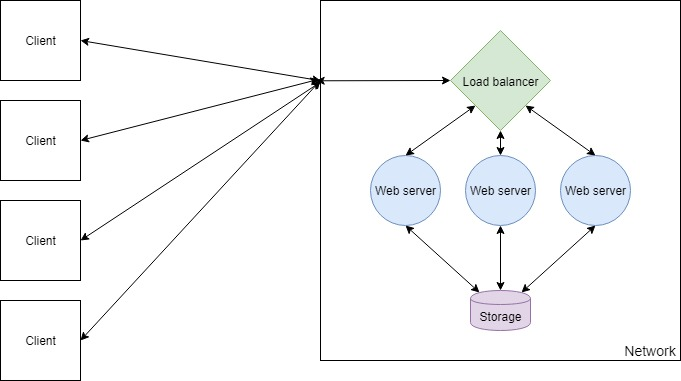
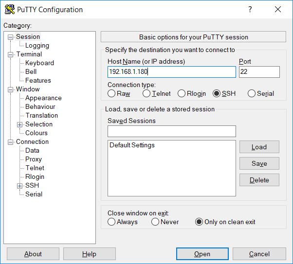
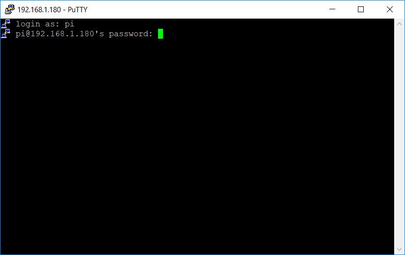
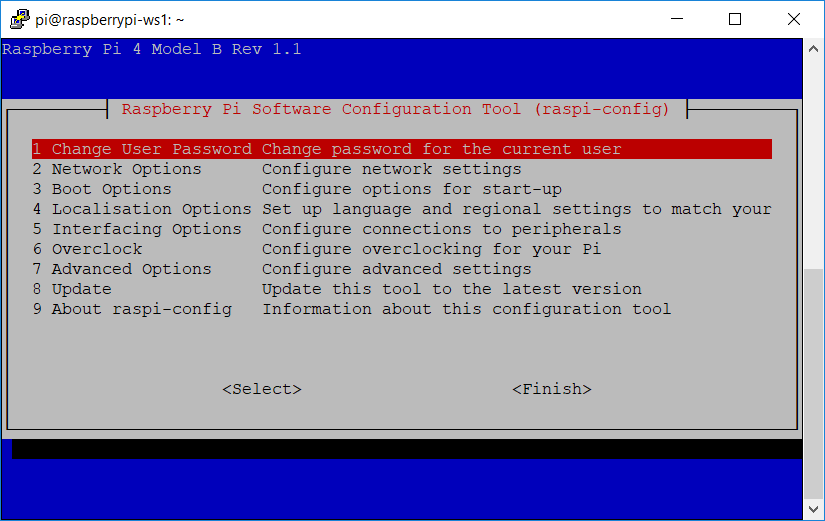

DocumentName: building_a_web_farm_with_docker_and_raspberry_pi
Title: Building a Web Farm With Docker and Raspberry Pi
Description: This was inspired by the fact that the Raspberry Pi launch site was hosted on a Raspberry Pi web farm. Follow this guide to have a go at building a small, cheap, but very powerful web farm, that is suitable for serving your website to tens of thousands of visitors per day.
Thumbnail: 823a7764-af7c-4687-a42e-bd70768068ab
Published: 2019-08-10
Updated: 2019-08-10
---


## Components of a web farm

A web farm is a structure where two or more computers run on a network to serve the same web application. Incoming web requests are routed to a load balancer server, which offloads the request to one of the computers on the network serving the web application.



The benefit of this approach is that adding more nodes to the network is trivial and therefore the request handling power of the network can be scaled appropriately. It also allows you to rebuild the application without taking it offline, as each node can be individually upgraded.

In this series, I will be explaining how to set up and deploy an ASP.NET Core application on a web farm. To do this, I will be using Nginx as the load balancer software and Kestrel for the web server. This setup is extremely lightweight and performant and both of these software's are cross-platform, meaning that this setup information applies to macOS, Linux and Windows too. You can swap out software wherever you wish, for example, you could configure to use IIS if you prefer. Before we begin, it is assumed that you have a basic understanding of Linux, Git and Docker and you have a web application that you want to host.

## Choosing hardware

### Raspberry Pi boards

As per the definition of a web farm, we are going to be needing a minimum of two computers available for running our web application. Depending on how heavy a web application you want to run in your web farm will depend on what model(s) of Pi you require, though at this time the 4B will likely be most fitting. Before I state anything, let me mention that I am not a hardware expert by any means and I realise there are a lot of factors, so take this advice with a grain of salt.

For the most part, you will not need a lot of RAM to run a web application, unless you are heavily utilising caching. CPU power is a factor when it comes to how quickly you want a request to be handled, so generally a CPU with a higher clock speed is better. More cores will allow more concurrent requests and so more traffic at one time.

### Storage

For storage, each Pi will need a micro SD card to store the OS and its files. Storage capacity required depends on whether your web application will store data and what type of data it will store. Generally you will want to isolate your persisted storage away from your web farm nodes, so for your nodes you will want cheap, low capacity cards.

### Networking

A web farm would prefer to run on ethernet than on WiFi as the network will be one of the biggest factors when it comes to speed. It is possible to run a web farm on WiFi and performance certainly won't be terrible, however a wired connection will always be faster. Therefore to run several nodes you should have an ethernet switch and cables.

### Power

Several ways exist to supply power to Raspberry Pi boards but by far the most convenient when using ethernet is to use PoE (power over ethernet). This can be achieved with a [PoE HAT](https://www.raspberrypi.org/products/poe-hat/) although do note that you will need an ethernet switch that explicitly supports PoE.

### The hardware setup

I'm going to go through the setup with the following supplies, totaling around £210, though with only 2 Pi boards it could be as cheap as £150:

* 3x Raspberry Pi 4B, 1GB RAM (£105)
* 3x 16GB Micro SD - [UK](https://amzn.to/2T4gokf) (£15)
* 3x PoE HAT (£54)
* 5-port PoE ethernet switch - [UK](https://amzn.to/2GJS8Ph) (£30)
* Ethernet cables - [UK](https://amzn.to/319HoBJ) (£3)
* 2.5mm standoffs - [UK](https://amzn.to/2Kcd0Rm) (£10)

First off we need to flash the operating system on to each SD card. We're going to use Raspbian Lite which you can find on the official Raspberry Pi [downloads pages](https://www.raspberrypi.org/downloads/raspbian/). Flashing the disk is very simple using [Etcher](https://www.balena.io/etcher/). Insert your SD card into a PC, run Etcher, select your downloaded OS image and select the drive on which your SD card is mounted. When you select flash the process shouldn't take more than a minute to complete.

Once your card is flashed, create a new file on the root of the drive on which your card is mounted and name it SSH. Creating this file will allow you to connect to the device via SSH protocol, which will let you remotely access your Pi.

```powershell
New-Item $drive/SSH -type file
```

The next step is to set up the hardware, which involves attaching the PoE HATs to the boards, inserting the cards into the micro SD slots, connecting the PoE HATs to the ethernet switch and connecting the ethernet switch to your router. I like to use spacers to secure the boards to one another, but you can get a specialised case kit if you want, although I'm not sure whether you'd be able to use them with PoE HATs. 

## Preparing the Pi

### Securing each device

Each Pi needs to be configured to be able to run each part of the web farm. We first need to connect to our Pi boards so that we can program them, which we do via SSH. This is possible as long as an empty file named SSH exists on the root of the Pi card.

To connect to the Pi you will need its local IP address and an SSH client, such as [Putty](https://www.putty.org/). You will be able to find the IP address of the Pi via your router dashboard and you will be able to connect via SSH using port 22.



Note that Windows 10 already comes with OpenSSH included, meaning you will not have to install any additional software. You should be able to use `ssh` command from the command line.

Open the connection and a terminal displaying a login prompt will appear. The default credentials for Raspbian are ```pi``` as the username and ```raspberry``` as the password.



Once connected to the Pi you should do several things, including changing the password, setting up a hostname and updating the software. To change the password and update the hostname, along with accessing many other useful configuration settings, run the command ```sudo raspi-config``` which will open up a configuration menu.



Running ```sudo apt update``` and ```sudo apt upgrade``` will update all of the software on the Pi and from there you will be prepared to install the software required to configure your web farm.

### Installing Docker

When it comes to deploying your application, Docker is a lifesaver, although on the Raspberry Pi the availability of preconfigured images is definitely limited. Raspberry Pi boards have ARM processors and so every image needs to be built from a base image that supports ARM/AArch. Luckily, support for ARM processors is rapidly increasing and should continue to do so.

Docker has an installation guide which you could follow, though you should simply be able to run this command which will do all the work for you.

```shell
$ curl -sSL https://get.docker.com/ | sh
```

Once that is done you can add the user to the docker group to allow you to run docker commands without sudo.

```shell
$ sudo usermod -aG docker $USER
```

You can test that this has worked by running the ```docker info``` command, which will give you some information about your docker installation. Install Docker on each one of your Pi boards as you will later create an image for your web application, which you will be able to pull on to each board and run your application in a container.

### Installing Docker Compose

Although not necessary, Docker Compose is a useful tool for configuring containers for a device. My favourite approach to using Docker Compose is by running it as a container, although unfortunately (as an example of what I mentioned earlier) the official image does not support ARM. Therefore, the easiest way to run Docker Compose on the Pi is installing it via pip.

```shell
$ sudo apt update
$ sudo apt install -y python python-pip libffi-dev python-backports.ssl-match-hostname
$ sudo pip install docker-compose
```

### Installing Git

With the approach I'm taking you through here, Git will be necessary as a part of the process of deploying our web application.

```shell
$ sudo apt-get install git
```

We will use Git to pull our configuration files on to the machines as it is simple to use and we can source control them.

## Persisting the storage

### Choosing a storage mechanism

Generally a web application will require persisted storage, unless it is simply serving static files, in which case you can skip over this section. As you will be wanting to access data across the local network, you will want to be running some form of storage server. This can be in the form of a SQL or NoSQL server or even NAS storage, depending on your needs.

When it comes to running a SQL server, there are limitations due to limited support for ARM. Both MySQL and PostgreSQL support ARM and have compatible Docker images. However their official images don't seem to be up to date, which can bring up issues when using an ORM such as Entity Framework. I will be using MariaDB, which has a well documented [image maintained by LinuxServer](https://hub.docker.com/r/linuxserver/mariadb/) community and has good support with Entity Framework. MongoDB, Redis and Cassandra just to name a few support ARM and have Docker images, so it seems you won't be limited for choice opting for NoSQL storage.

### Running MariaDB with Docker

By using the image for MariaDB linked above, we can configure a SQL server to run in a container on one of our Pi boards. It is possible to specify configuration parameters in the Docker ```run``` command though I find using the YAML syntax of Docker Compose more convenient. I suggest you create this Docker Compose file and commit it to a Git repo, so that you can easily version control it and clone it on to your Pi to build.

```yaml
version: "3"
services:
  mysqldb:
    image: linuxserver/mariadb
    container_name: mariadb
    environment:
      - PUID=1000
      - PGID=1000
      - TZ=Europe/London
      - MYSQL_ROOT_PASSWORD=RootPassword
      - MYSQL_DATABASE=DatabaseName
      - MYSQL_USER=DatabaseUser
      - MYSQL_PASSWORD=DatabaseUserPassword
    ports:
      - 3306:3306
    restart: unless-stopped
```

In this configuration several parameters are of note. The environmental variables contain PUID and PGID variables. These do not need to concern you unless using volumes, in which case the image description details what they need to be. Generally you will want to set them to 1000 anyway. The TZ variable specifies the time zone of the container, which you will want to set it to your local time zone. The rest of the environmental variable will configure your database credentials and should be self-descriptive.

If you don't have much experience with Docker, you might be wondering what the ports configuration is for. The ports configuration maps an external port on the machine to an internal port on the container. Above we are mapping port 3306 on the Pi to port 3306 in the container, which is exposed in the MariaDB image.

With this configuration ready, the connection string in the web application needs to be set to reflect this.

```
Server=192.168.1.180;Port=3306;Database=DatabaseName;Uid=DatabaseUser;Pwd=DatabaseUserPassword;SslMode=Preferred;
```

Get the Docker Compose file on to your Pi and run ```docker-compose up``` to create and start a container. You are now able to connect to your database server and run SQL commands.

## Setting up a load balancer

### LetsEncrypt Nginx

Generating an SSL certificate for your website can be automated by Certbot, which generates a certificate issued by LetsEncrypt. This can be run in a container, although unfortunately the official Certbot image does not support ARM. There is an alternative using Docker. LinuxServer community maintains an [image](https://hub.docker.com/r/linuxserver/letsencrypt/) for an Nginx server with Certbot running. As there is a little bit of configuration to do, using Docker Compose makes setting this up much easier.

```yaml
version: "3"
services:
  letsencrypt:
    image: linuxserver/letsencrypt
    container_name: nginx
    cap_add:
      - NET_ADMIN
    environment:
      - PUID=1000
      - PGID=1000
      - TZ=Europe/London
      - URL=developmomentum.com
      - SUBDOMAINS=www
      - VALIDATION=http
      - EMAIL=your@emailaddress.com
      - STAGING=false
    volumes:
      - ./yourdomainname.conf:/config/nginx/site-confs/yourdomainname.conf
      - ./nginx.conf:/config/nginx/nginx.conf
    ports:
      - 80:80
      - 443:443
    restart: unless-stopped
```

Many environmental variables can be set running this container, mainly for the configuration of Certbot. The URL and subdomains provided set the URL for the certificate. When accessing the application, the browser looks at the certificate URL and validates against the URL which returned it. You must provide a method of certificate validation, the simplest of which is HTTP validation but the most comprehensive DNS validation, as it allows you to create a wildcard certificate covering any subdomain.

Nginx server configuration for the container is done by mounting conf files to the /config/nginx/site-confs directory. The image sets a default configuration for Nginx but we want to override this when accessing the load balancer via our domain names. We're mapping both ports 80 and 443 in the container, although we want all traffic to be SSL encrypted. Create the following file yourdomainname.conf and configure it to listen on ports 80 and 443, redirecting all HTTP traffic over port 80 to port 443.

```nginx
# list web application server IPs
upstream webservers {
    server 192.168.1.210;
    server 192.168.1.220;
}

# redirect all HTTP traffic to HTTPS
server {
    listen 80;
    server_name yourdomainname.com www.yourdomainname.com;
    return 301 https://$host$request_uri;
}

# route traffic to web application servers
server {
    listen 443 ssl;
    server_name yourdomainname.com www.yourdomainname.com;

    add_header X-Frame-Options "SAMEORIGIN";
    add_header X-Content-Type-Options "nosniff";

    location / {
        proxy_pass          http://webservers;
        proxy_http_version  1.1;
        proxy_set_header    Upgrade                 $http_upgrade;
        proxy_set_header    Connection keep-alive;
        proxy_set_header    Host                    $host;
        proxy_cache_bypass                          $http_upgrade;
        proxy_set_header    X-Forwarded-For         $proxy_add_x_forwarded_for;
        proxy_set_header    X-Forwarded-Proto       $scheme;
    }
}
```

### What's left to do?

Running the Nginx image, as long as the web servers are running the web farm should now be configured. There is some set up left to do to allow others to access it, which requires setting up DNS and port forwarding on your router. Most routers have dynamic IP addresses, requiring you to set up a dynamic DNS that integrates with your internet provider. Fortunately the configuration for Nginx does not need to be changed when setting up dynamic DNS.