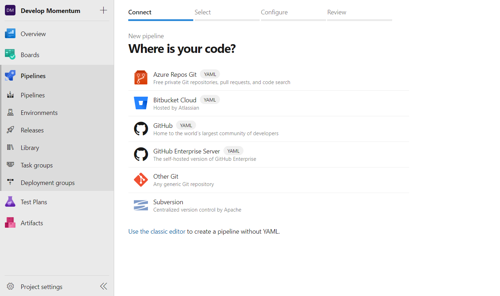
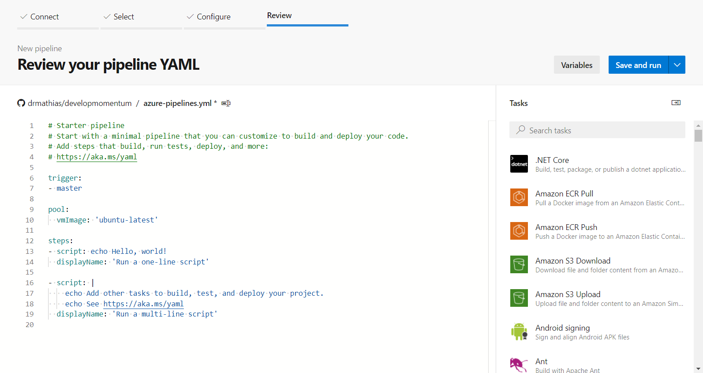
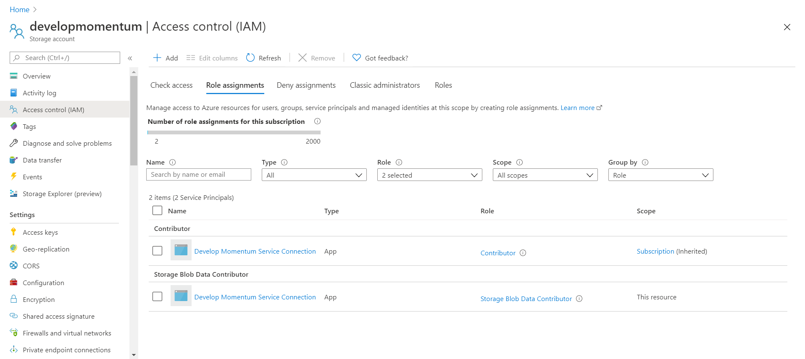

DocumentName: continuously_deploy_a_static_website_with_azure_pipelines
Title: Continuously Deploy a Static Website With Azure Pipelines
Description: With multi-stage pipelines now officially released, Azure pipelines is more powerful than ever. Explore how you can set up CI/CD pipelines to automate the deployment of your static website.
Image: a1ee6dcf-55ef-43cd-ae05-682d2e28e932
Published: 2020-06-05
Updated: 2020-06-05
---


## Introducing CI/CD

Deploying applications can be a tedious task, with people historically having to write their own scripts if they wanted to avoid long, manual processes. Every project and every organisation runs on a different infrastructure, so for a long time, there was never an easy way to automate these processes. For each deployment, the same processes would have to be repeated and so it took up a lot of time. Fortunately, the widespread adoption of cloud computing and investment in DevOps, has changed this. Now it is easier and cheaper than ever, to fully automate with CI (continuous integration) and CD (continuous deployment).

## The deployment process

### Step by step

To begin, we need to break down the deployment process step by step. This makes it clear exactly what you need to do and in what order. Sometimes deployments require one step, while others can require tens of steps. Combined, all the steps will make up a pipeline. 

### For a static website

When deploying a static website, at its core, the process seems very basic. Files simply need to be copied to the correct location on the host machine. Various protocols are available to do this, whether it be SFTP, FTPS, HTTPS or whichever else. The protocol used will depend on your hosting provider.

Most likely you will be using a static website generator, so will want to prepend steps to transform your input into your output files. The tasks required for this depend on your tech stack. At a generic level, the tasks involved will include installing dependencies, navigating the file system and running tool-specific commands.

## Azure pipelines

### Pipeline anatomy

[Azure pipelines](https://docs.microsoft.com/en-us/azure/devops/pipelines/?view=azure-devops) is a high-level, extensible, cloud-native platform, designed for fully automating code integration and deployment. Azure pipelines offers both build and release pipelines, with build pipelines originally intended for continuous integration and release pipelines for continuous deployment. Build pipelines have evolved and been optimised for both continuous integration and deployment, with them being rebranded as multi-stage pipelines, while release pipelines are now a legacy feature.

When creating Azure pipelines, you specify stages, in which you define executable jobs, which are made up of one or more tasks. This is a way of sectioning your pipelines, so that you can respond to different outcomes for each stages of your pipeline. Azure pipelines comes with hundreds of pre-configured tasks and allows you to run custom scripts, or even create your own task extensions.

It might also be worth mentioning that you can set up different environments for your builds and run them on different machines. It is easiest to run builds on Azure-hosted machines, but if you want you can set up agents to run them on your own machines.

### Agents

Azure pipelines agents are installed on the machines that run your builds and releases. It is useful to understand how agents are setup, so that you can correctly define your pipelines.

Job agents for build pipelines run a build in a numbered directory $(Agent.BuildDirectory), that by default contains three subdirectories: `\a` $(Build.ArtifactStagingDirectory), `\b` $(Build.BinariesDirectory) and `\s` $(Build.SourcesDirectory). Agents have [predefined variables](https://docs.microsoft.com/en-us/azure/devops/pipelines/build/variables?view=azure-devops&tabs=yaml), which can be referenced from your build pipelines, including the variables listed to reference these directories.

Agents are set up slightly differently for classic releases. They contain a numbered directory that is prefixed by an _r_, with the only subdirectory being `\a` $(System.ArtifactsDirectory). Likewise with build pipelines, classic release pipelines also have a set of [predefined variables](https://docs.microsoft.com/en-us/azure/devops/pipelines/release/variables?view=azure-devops&tabs=batch).

### Stages and jobs

Whether you opt to use multi-stage pipelines or classic releases for deployment, you need to decide how to structure your pipelines. Stages are meant as a high-level grouping of work, with jobs being a unit of work that run on a machine. Therefore, it is common to separate your pipeline into stages such as _Build_, _Test_ and _Release_, while jobs might be _Transform Files_, _Upload Files to Network_ or _Notify Users of Updates_. As well as standard jobs, Azure pipelines has special deployment jobs.

### Artifacts

In Azure pipelines, each job runs on a different machine, so often files need to somehow be transferred between stages and jobs. This is most easily done with [artifacts](https://docs.microsoft.com/en-us/azure/devops/pipelines/artifacts/artifacts-overview?view=azure-devops), which are a set of tasks for transferring files in your builds.

## A pipeline in practice

### Structuring our pipeline

For a static website, we want to take the code in our source control repository, then transform that into a set of files that are ready to deploy. After that, we want to deploy these files to our web host. It is logical to group this in to two stages: _build_ and _release_. The build stage is likely to only require one job, as building your project and transforming your input files is one unit of work. Deployment jobs are meant to run through your entire deployment, so your release stage should also require one job, as most likely you will only have one deployment target.

### Setting up the pipeline

If you do not have one already, create an [Azure DevOps](https://azure.microsoft.com/en-us/services/devops/#DevOps) organisation and project. 
Navigate to the _Pipelines_ tab in your Azure DevOps project, then select _New pipeline_.



You will need to connect to your source control repository as the first step to setting up your pipeline. Next select a pipeline template; it's easiest to start off with the _Starter template_. Once you have done that, you will be presented with the pipeline editor. Azure pipelines are configured in YAML, though Azure DevOps contains a handy assistant which honestly makes things 10x easier! For each task you use, take a look at the documentation if you are struggling to understand the configuration required.



The pipeline definition contains a trigger, which is the branch that is monitored for changes, to begin a new build. Likely you will want to keep this as master. A pool is also defined, which specifies the agent machines to run on. Pools can be defined at the root, per stage or per job. Be aware that if deploying to Azure, some tasks are windows-only.

You may notice that the template contains definitions for steps, but not stages or jobs. This is because if you only have one stage and one job, you do not need to explicitly define them in the pipeline. Start off by removing all the steps and define the stages and jobs that you have planned out. I also like to define the artifact name(s) as variables, for the artifacts that I will be creating to transfer files between each stage.

```yaml
trigger:
- master

pool:
  vmImage: 'windows-latest'

variables:
  ARTIFACT_NAME: DevelopMomentumWeb

stages:
- stage: Build
  displayName: Build

  jobs:
  - job: Transform
    displayName: Transform Input

- stage: Release
  displayName: Release
  dependsOn: Build

  jobs:
  - deployment: DeployToStorage
    displayName: Deploy to Azure Storage
```

Stages will run in parallel, unless they are defined as having a dependency on another stage. You are able to define conditions for each stage to run. The default condition is that their dependant stages completed successfully.

### The Build stage

Having connected your repository, for standard jobs, the agent will copy your code into the `\s` directory and set that as the working directory. Therefore, the first thing you need to consider is the installation of build dependencies. Azure-hosted agents already have a lot of software installed, meaning you might not need to define any steps for this. You can view the included software by clicking the links in the agents table on the [Microsoft documentation](https://docs.microsoft.com/en-us/azure/devops/pipelines/agents/hosted?view=azure-devops&tabs=yaml#software).

In this example, I'll be building a static website using .NET Core and Statiq, therefore I need to perform the CLI commands `dotnet restore`, `dotnet build` then `dotnet run`. Azure pipelines comes with a task `DotNetCoreCLI`, which I will use. For each task, I need to provide the project path, which can be placed in a variable. Statiq only outputs files if the working directory is set to the directory containing the input folder, so this needs to be defined in the task. Something that I didn't realise at first, was even with the working directory defined, the project path in the `DotNetCoreCLI@2` task must be defined relative to the `\s` directory.

```yaml
- job: Transform
  displayName: Transform Input

  variables:
    project: 'src/Blog.csproj'

  steps:
  - task: DotNetCoreCLI@2
    displayName: Restore
    inputs:
      command: 'restore'
      projects: $(project)

  - task: DotNetCoreCLI@2
    displayName: Build
    inputs:
      command: 'build'
      projects: $(project)
      workingDirectory: 'src'

  - task: DotNetCoreCLI@2
    displayName: Generate
    inputs:
      command: 'run'
      projects: $(project)
      workingDirectory: 'src'
```

Now we need to publish the artifact, which is the output folder that Statiq generates. Generally, artifacts should be staged before being published, which involves copying them to the `\a` directory. You should do this with the `CopyFiles` task, which takes the source and target folders as parameters. Publishing artifacts can be done with either the `PublishBuildArtifacts` or `PublishPipelineArtifact` task, yet it is recommended to use pipeline artifacts, as they are intended as a replacement to build artifacts.

```yaml
- task: CopyFiles@2
  displayName: Copy
  inputs:
    SourceFolder: '$(Build.SourcesDirectory)/src/output'
    Contents: '**'
    TargetFolder: '$(Build.ArtifactStagingDirectory)/output'

- task: PublishPipelineArtifact@1
  displayName: Share
  inputs:
    targetPath: '$(Build.ArtifactStagingDirectory)/output'
    artifact: '$(ARTIFACT_NAME)'
    publishLocation: 'pipeline'
```

### The Release stage

The build stage is now defined and so we can look at the release stage. We've defined a deployment job, which is currently missing an environment and a strategy. 

Multiple environments can be useful when creating responsive, large-scale applications, though in this case we do not have to worry about them. We just want a single empty environment, which we can get by providing any environment name.

To finish, we need to define the deployment strategy, which is a process that can contain the following hooks:

* `preDeploy` - used for resource initialisation
* `deploy` - performs the actual deployment
* `routeTraffic` - configuration to serve updated version
* `postRouteTraffic` - meant for health monitoring / user notifications
* `on: failure` - to perform rollbacks
* `on: success` - meant for clean up

There are three different deployment strategies, though the only one you need to be concerned about is `runOnce`. This strategy is the simplest of the three, as it runs each stage of deployment one time per build.

```yaml
  jobs:
  - deployment: DeployToStorage
    displayName: Deploy to Azure Storage
    environment: developmomentum-production
    
    strategy:
      runOnce:
```

In my example case, the website needs to be deployed to Azure Storage, which involves deleting the old files then copying the new files to the storage container. The website uses Azure CDN and Cloudflare as a DNS provider, both of which cache the website. These caches need to be cleared on every deployment, so that traffic is served correctly.

```yaml
variables:
  AZURE_STORAGE_ACCOUNT: developmomentum
    
strategy:
  runOnce:
    deploy:
      steps:
      - task: AzureCLI@2
        displayName: 'Delete Existing Files'
        inputs:
          azureSubscription: 'Pay-As-You-Go (8df2aaab-fa1b-4031-9a60-43ebee006b38)'
          scriptType: 'pscore'
          scriptLocation: 'inlineScript'
          inlineScript: 'az storage blob delete-batch -s `$web --account-name $(AZURE_STORAGE_ACCOUNT) --auth-mode login'

      - task: AzureFileCopy@4
        displayName: 'Copy Files to Storage'
        inputs:
          azureSubscription: 'Pay-As-You-Go (8df2aaab-fa1b-4031-9a60-43ebee006b38)'
          SourcePath: '$(Pipeline.Workspace)/$(ARTIFACT_NAME)/*'
          Destination: 'AzureBlob'
          storage: '$(AZURE_STORAGE_ACCOUNT)'
          ContainerName: '$web'
            
    routeTraffic:
      steps:
        - task: PurgeAzureCDNEndpoint@2
        displayName: 'Purge Azure CDN Endpoint'
        inputs:
          ConnectedServiceNameSelector: ConnectedServiceNameARM
          ConnectedServiceNameARM: 'Pay-As-You-Go (8df2aaab-fa1b-4031-9a60-43ebee006b38)'
          ResourceGroupName: developmomentum
          EndpointName: developmomentum
          ProfileName: developmomentum
        continueOnError: true

        - task: tfx-cloudflare-purge@1
        displayName: 'Purge Cloudflare Cache'
        inputs:
            username: 'adamshirt@outlook.com'
            apikey: '$(CLOUDFLARE_API_KEY)'
            zonename: developmomentum.com
        continueOnError: true
```

In my definition, I'm using an Azure CLI task, which takes an inline script. Scripts and script based tasks can include variables and Azure pipelines will automatically convert them into environmental variables, which will be passed into the script.

I'm using a couple of extension tasks for cache purge, which can be found in the task assistant. These tasks need to be installed before you can use them in your pipelines. I'm also defining that the cache purge steps should not disrupt the pipeline, even if they fail.

The Cloudflare cache purge task requires an API key, which must be kept secret. You can define secret variables by adding a variable in the _Variables_ menu, selecting _Keep this value secret_.

Secret variables cannot be passed into scripts. For this reason, Azure CLI authentication cannot be done using keys. Each Azure subscription I have defined is a reference to a service connection that has been set up.

### Authentication

Service connections allow your pipelines to authenticate with external applications. Setting up a service connection in Azure DevOps is easy. In your project, navigate to _Project Settings_, then select _Service connections_. Create a service connection by selecting _New service connection_ and going through the wizard.

### External Permissions

With a service connection set up, you may need to configure permissions in your external service. I am running an Azure CLI command against Azure Storage, which requires the service connection to be granted the permissions to delete files from Azure Storage.

Azure products manage permissions with _Access control (IAM)_, which allows you to assign roles to various entities in Azure. With role assignments, you can give your service connection whatever permissions are needed.



### Committing the pipeline

With the build pipeline now defined, you can save it, which will commit the `azure-pipelines.yml` file to the root of your repository. I recommend selecting _Create a new branch for this commit_, as you might need to tweak your initial configuration, which is better done on a separate branch. You'll then be able to run your build pipeline.

## Common deployment targets

### Deploying to Azure

Being an Azure branded product, Azure pipelines has incredible integration with Azure. There are so many [native tasks](https://docs.microsoft.com/en-us/azure/devops/pipelines/tasks/?view=azure-devops#deploy) and deploying to Azure is easy. Instead of going into too many details, I will point you towards reading the documentation for the specific tasks, which is extensive.

### Deploying to AWS

Azure Pipelines has great support for deploying to AWS, via the [AWS tools extension](https://marketplace.visualstudio.com/items?itemName=AmazonWebServices.aws-vsts-tools). Installing the extension for your organisation will make a bunch of AWS tasks available for your pipelines. The [user guide](https://docs.aws.amazon.com/vsts/latest/userguide/welcome.html) for the extension contains a task reference, which goes into details regarding the parameters available for each task.