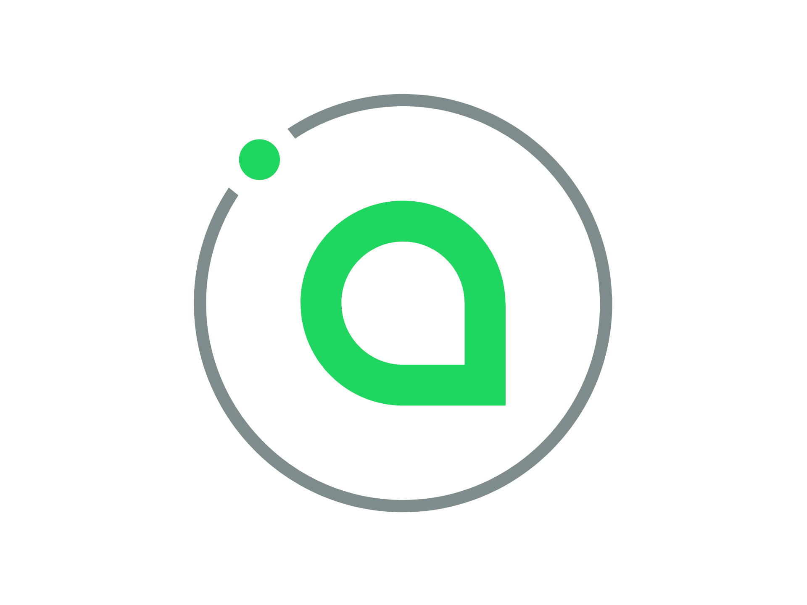
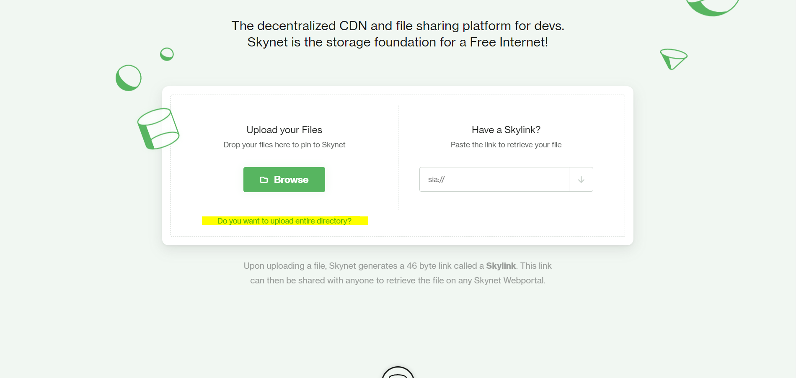

DocumentName: decentralise_your_website_as_much_as_possible
Title: Decentralise Your Website, as Much as Possible
Description: The web is currently centralised, with large corporations controlling massive server farms, that are used to serve much of the content on the web. Learn how you can implement Sia Skynet, to host and distribute your content on the decentralised Sia storage network.
Thumbnail: 9aeea0d6-737c-4be8-8b63-5ec38cbf394b
Published: 2020-04-05
Updated: 2020-04-05
---


## Distribution of content

### Web hosting options

There are so many different ways to host a website. You can host it directly on a cloud platform, rent a server from a web hosting company, or set up your own. No matter how you build your website, all of these options work well. Often, the decision on which method you choose to host your website, depends on what factors you consider most important. Do you care about speed and scalability? Then a cloud platform is probably best for you. Do you care about cost and flexibility? You might be better off renting a web server. How about ownership of your content and data? Then you might decide to use your own machine.

For the majority of cases, control of your content is not an issue to worry about, when relying on a 3rd party for web hosting. While you place trust on the 3rd party, it's not as if a company would care to actively censor a travel blog, for example. Generally it is detailed in their terms, what they can and cannot do with your content. There are also so many different hosting companies and cloud providers available, that you could simply switch if you had any concerns. But there are sometimes reasons you may care. It could be as a matter of principal, or maybe your content is politically controversial.

### Decentralisation

Transferring control from one party, to many parties, through decentralisation, is quickly becoming a popular idea for the web. Decentralisation is an answer to the problem of censorship and the implementation is implicitly scalable. Blockchain technologies have brought a lot of attention to these problems, along with providing funding models to allow people to develop technological decentralised solutions. The web is slowly, but steadily, starting to become decentralised.

## Sia decentralised storage



### History of Sia

The Sia blockchain was started back in 2014, with a vision to build a peer to peer decentralised storage platform. You can read the whitepaper [here](https://sia.tech/sia.pdf). For many years, Sia has been offering private storage at incredibly cheap prices, as there are hundreds of hosts completing for contracts. Sia has built in redundancy of data, which means that any data that is uploaded to the network is backed up. Data is stored across many hosts, with no single host being able to access the data, meaning that uploaded data is private and secure.

### Sia Skynet

On 18 February 2020, Sia [announced](https://blog.sia.tech/skynet-bdf0209d6d34) Skynet, a file sharing layer built on top of Sia blockchain. Skynet allows anyone to upload their files to the Sia network, then share them via a 46 byte link. Skynet is very easy to use and integrate, making it a very effective decentralised CDN storage layer.

## Website decentralisation

### Considerations

You cannot yet decentralise your website completely. In fact, you cannot decentralise it much at all. As long as HTTP is the standard, the web will be centralised. HTTP forces content to be retrieved through a single server. If you're interested, take a look at [IPFS](https://ipfs.io), to understand what the decentralised web might look like. For now, you will still be using HTTP and realistically a centralised DNS provider. Sia Skynet has however opened up the possibility to decentralise website content.

### Feasibility

Decentralising your content will require extra work when setting up your website. It could negatively impact performance and SEO, depending on your exact website setup. For optimum performance you must run your own Sia node, which comes with a small cost.

At this time, I do not recommend using a public portal, as although this is cost-free, download speeds are slow due to high usage. David Vorick, the lead developer of Skynet, did [state](https://twitter.com/DavidVorick/status/1244715979214663680) that the Sia team are continuously working to improve performance. It should also be noted that by using a public portal, you are trusting the portal host to handle your requests correctly.

### Static websites

A static website is a setup where HTML files are served straight to the browser. Sia Skynet can serve files to the browser, through a web portal, meaning that Skynet can host static websites.

Hosting static websites on Skynet comes with its own challenges. Firstly, Skylinks are dependent on the content, which means that adding, removing, or editing content, will update the Skylink. Every time you update your website, the link will change.

There are ways to deal with this. One solution would be to create an endpoint that returns the latest Skylink. This could be resolved by a HTML page containing a JavaScript function, or a serverless function run by your DNS provider.

```javascript
fetch('https://www.example.com/resolve/skylink')
    .then(request => {
        if(request.status !== 200) {
          // handle error
          return;
        }
        
        request.text()
          .then(skylink => {
            const url = 'https://skynet.developmomentum.com/'.concat(skylink).concat('/index.html');
            window.location.replace(url);
          });
    }).catch(error => {
        // handle error
    });
```

Another difficulty you will face is correctly defining links. Any root-relative links will not work when accessing your site through a portal, therefore it is important to replace these with relative links instead. This can be quite a challenge, since you will likely be using a static generator to generate your website. Links must also include the full file name, as Skynet does not recognise default file names.

Make sure to explicitly define the location of your favicon, else the browser will not be able to locate it, since it defaults to looking for it at the site root.

```html
<link rel="shortcut icon" href="../favicon.ico" />
```

The simplest way to get your static website running on Skynet, is to upload the root directory via a Skynet portal. Navigate to any Skynet portal, click on _Do you want to upload entire directory?_ and then select the root directory of your website.



Once the upload has completed, you will receive a Skylink for the directory. When navigating the website, every page must be explicitly specified by name in the URL path.

Since Skynet can be interacted with via a web API, it is possible to set up an automated continuous deployment pipeline, that deploys your site to Skynet.

### Dynamic websites

Dynamic websites require a compute layer, as a server processes requests and serves content accordingly, meaning that Skynet cannot directly serve dynamic web pages. Where Skynet could be used however, is as a host for a cache, or to store pre-processed files.

In the future we may see popular CMS get built-in Sia support, in the form I just described. Integrating Sia as a storage layer can be done via Sia [web API](https://sia.tech/docs/#skynet), which is language agnostic. The documentation is quite good and there are bindings available in several languages, including Python, JavaScript and Go.

## Wrapping up

You probably shouldn't decentralise your website just yet. But if you want to, go for it! I went ahead and made Develop Momentum available on Skynet, at [sia://AADNvJAVSxY8oO_4GmLussumjK4sm5JyhOt7-F9v_Z_KdA](https://skynet.developmomentum.com/AADNvJAVSxY8oO_4GmLussumjK4sm5JyhOt7-F9v_Z_KdA). As a storage provider, Sia is not far off from beating all the major cloud platforms in terms of speed, cost, scalability and ease of use. It is brilliantly designed and an amazing product, though it does have its shortcomings. Many years from now, we might even look back on Skynet as being the start of the decentralised web.