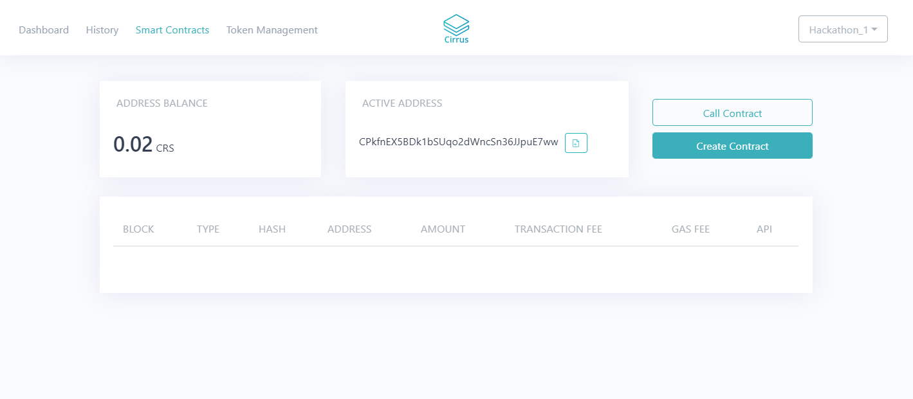

DocumentName: developing_smart_contracts_for_business
Title: Developing Smart Contracts for Business With .NET
Description: Smart contracts are perfect for integrating automated, trustless financial transactions into your applications. Learn the basics of how to develop smart contracts with .NET, by using Stratis platform.
Thumbnail: 2a40df99-1847-4726-9c5b-af4779eeb667
Published: 2019-12-18
Updated: 2019-12-18

---


## Blockchain in .NET

Although blockchain is now becoming a massively popular field in software development, not many .NET blockchain projects exist. The original implementation of Bitcoin was developed in C++, which along with Python, Go, Java and JavaScript, make up the majority share of blockchain development stacks.

One of the first .NET blockchain projects was [NBitcoin](https://github.com/MetacoSA/NBitcoin), a Bitcoin library implementation developed initially by Nicolas Dorier. Nicolas is well known in the blockchain world and has written a book, [Programming the Blockchain in C#](https://programmingblockchain.gitbook.io/programmingblockchain/), which I recommend reading if you're interested in learning the details behind the implementation of blockchains. In terms of actual blockchains primarily written in .NET, the only notable ones are NEO and Stratis. These two projects both support the creation of smart contracts. In this article I will be focusing on the Stratis platform, as it is a flexible blockchain solution which is written native in .NET with many interesting features.

## Stratis platform

Stratis platform is a programmable blockchain platform which allows anyone to provision a full node which can interact with either the Bitcoin or the Stratis network. Stratis is based off of NBitcoin, which I mentioned earlier, and so it supports the Bitcoin network, though that is not what we're going to focus on.

We're going to focus on the Stratis network, which utilises the STRAX token and runs off of a separate consensus to Bitcoin. Stratis Group is a company based in London, which offers a BaaS (Blockchain as a Service) solution, allowing you to provision a virtual machine running a full node on Azure cloud. The STRAX token is a utility token, with its utilities being to secure sidechains, use with smart contracts (via a proxy token) and for ICO (Initial Coin Offering) contribution.

Due to Stratis still being somewhat in the experimental phase, the technical information provided further on could change rather rapidly.

## Smart contracts

### How they work

Smart contracts are bytecode that is invoked by transactions on the chain. Smart contracts have an address which is unique to them on the network, allowing them to interact with peers. Transactions that are broadcast with the contract as the recipient, alter the state of the contract, which is persisted between every node on the blockchain.

Smart contracts must not be deterministic, meaning that the code must be replicable on every machine to produce the same result. This comes with limitations in terms of features which are available when writing smart contracts, for example, you cannot use time constructs or floating point representation of numbers directly in code.

### How Stratis implements .NET smart contracts

Stratis currently only supports C# as a language for writing smart contracts. Smart contracts are written as a singleton type; that is they are initialized once. The initialized type exists for as long as the blockchain, therefore it essentially has an infinite lifetime. The object itself cannot use fields to store state and instead acts as a set of members which can be called, though that does not mean that the smart contracts cannot persist data.

Stratis smart contracts can access a property `PersistentState`, which provides methods to persist data inside the execution of the smart contract, to the blockchain. When this is invoked from the contract, the state is persisted to all nodes on the chain.

As smart contracts cannot be deterministic, there is a whitelist of language features and types which can be used in their creation. To validate and compile smart contracts, Stratis provides a [command line tool](https://github.com/stratisproject/Stratis.SmartContracts.Tools.Sct), that utilises Rosyln to analyse the code and compile it into bytecode.

Stratis allows you to deploy smart contracts to run on their Cirrus side chain, which is connected to the main chain and utilises its own token CRS. You can exchange between STRAX and CRS and back at a rate of 1:1. CRS is used entirely for smart contracts, including for depositing to contracts and to pay fees (gas).

## Writing a contract

### SmartContract.cs

Start off by creating a new project for your smart contract. You can install a template for this, or simply create a new empty project. Stratis have both a CLI and a VSIX template. If starting with an empty project, install the NuGet package [Stratis.SmartContracts](https://www.nuget.org/packages/Stratis.SmartContracts), which contains the tools that you need.

One of the first things to note is that smart contracts restrict the language and framework features that you can use. In a smart contract, you cannot include a namespace. Create a file for your contract and define a class, with the type `SmartContract` as its base.

<?# highlight csharp ?>

```csharp
using Stratis.SmartContracts;

public class CountingContract : SmartContract
{
   public CountingContract(ISmartContractState smartContractState) : base(smartContractState)
   {
   }
}
```

<?#/ highlight ?>

The `SmartContract` base class contains members which you might want to access in your smart contract. When writing smart contracts, there are some things to keep in mind. Firstly, any value of CRS is represented in CRS sats (100 millionth of a CRS), which is especially important if your contract is for a financial purpose. Another point is that smart contracts are limited to using only the following types:

- Primitive types
- Structs
- Arrays

You cannot at the time of publication use objects other than Array.

### Limiting risk

One of the biggest disadvantages of smart contracts is the inherent risk of creating a new contract, due to their monetary nature. Some smart contracts can hold vast amounts of value, therefore it is critical that contracts are fully tested and reviewed. Rather famously, cryptocurrency wallet Parity had a bug in one of its smart contracts that froze a massive 513,774.16 ETH.

Before you make up your mind and run off into the wind, remember that many businesses are currently utilising smart contracts today, with no problems whatsoever! You can protect against bugs through vigorous auditing of contracts. Think peer reviews done by everyone on your team and even external stakeholders. Such processes can significantly limit risk, to a point where it becomes acceptable for the business.

Outside-in test driven development is a good practice to follow when writing smart contracts. This approach follows the pattern of writing failing unit tests for your contracts first, writing the code to pass those tests, then repeating with all possible pre-conditions and scenarios in which that unit of code is executed. Another name for this common approach is red, green, refactor. The advantage of this is that it forces you to think about potential for bugs throughout the development process of a smart contract. Tests are extensive as they become the primary focus of development.

### Writing tests

Writing unit tests for smart contracts is just like writing tests for any other code. You can use whichever testing and mocking libraries you wish. Create a separate test project to contain your tests and install a mocking library of your choosing. Unit tests are the simplest way of testing smart contracts, though you can test futher by publishing your smart contracts to the testnet blockchain.

In the following examples, I'll be using Moq as it is probably the most popular .NET mocking library. Set up a class to contain your tests and mock the dependencies for your smart contract.

<?# highlight csharp ?>

```csharp
public class CountingContractTests
{
    private Mock<ISmartContractState> _smartContractState;
    private CountingContract _countingContract;

    [SetUp]
    public void SetUp()
    {
        _smartContractState = new Mock<ISmartContractState>();
    }
}
```

<?#/ highlight ?>

### Examples

You can see examples of smart contracts that were written for the Stratis hackathon, by navigating to the [hackathon submission page](https://stratisplatform.devpost.com/submissions).

## Deployment of smart contracts

### Methods of deployment

Smart contracts can be deployed via the API, through the Cirrus Core wallet UI or inside a smart contract itself. Deploying a contract outside of a smart contract requires that you compile it into bytecode. This can be done with the command line tool.

Clone the [tool](https://github.com/stratisproject/Stratis.SmartContracts.Tools.Sct) onto your machine and open the command line. Navigate to the directory of the cloned project and run the following command.

<?# highlight sh ?>

```shell
dotnet run --validate [pathToContract.cs] -sb
```

<?#/ highlight ?>

If the contract is invalid, this will display a trace that details the error, allowing you to easily resolve it. For a valid contract, you will see byte code output to the console, which you need to copy to deploy the contract.

### Deployment parameters

Along with the bytecode of the smart contract, deployment requires several parameters to be set.

- Wallet name - This is the name of the wallet which contains the address that you want to deploy the smart contract from.
- Amount - The amount of CRS you want to send to the contract on deployment.
- Fee - Transaction fee you want to pay.
- Password - The password for accessing the wallet.
- Gas price - Price you pay for smart contract execution cost measure, gas. The gas price equates to the CRS cost / gas.
- Gas limit - Maximum amount of gas you want to spend on the call, before it fails.
- Sender - Address you wish to use for the transaction to deploy the contract.

When deploying a contract in another contract, you only have to manually set the gas limit and the amount.

### Deploying with the API

The web API includes an endpoint that can be called to create a smart contract.

<?# highlight http ?>

```http
POST /api/SmartContractWallet/create HTTP/1.1
```

<?#/ highlight ?>

Call this endpoint with a request body structured as so.

<?# highlight json ?>

```json
{
  "walletName": string,
  "amount": string,
  "feeAmount": string,
  "password": string,
  "contractCode": string,
  "gasPrice": ulong,
  "gasLimit": ulong,
  "sender": string,
  "parameters": [
    "typeNumber#value"
  ]
}
```

<?#/ highlight ?>

The parameters are passed as key-value pairings with the key being a number representing the type. Further information explaining this can be found on [Stratis Academy](https://academy.stratisplatform.com/Architecture%20Reference/SmartContracts/working-with-contracts.html#parameter-serialization).

### Using Cirrus Core

Cirrus Core allows you to create smart contracts through the UI. Navigate to the smart contracts tab, select create contract, and fill out the modal form. When you submit the contract, you will be able to view this in the UI.



### Inside a contract

Smart contracts can deploy other contracts, potentially opening up interesting use cases. This is done simply by calling `Create<T:SmartContract>(ulong amount, object[] params, ulong gasLimit)` which will require a reference to the smart contract.

## Saving gas

### Contract logging

When developing an application which interacts with a smart contract, it is important to be able to minimise fees which are incurred when doing so. Stratis smart contracts have the `Log<T:struct>(T)` method, which enables you to log data that can be queried using the API of the full node. Querying logged data does not cost gas and therefore this is very useful when you want to store metadata for a contract.

Lets say that you want to store some details for your contract, specifically an id, name, company and author, that a third party can query and display. You are able to create a struct type to contain this data.

<?# highlight csharp ?>

```csharp
public struct Details
{
    public int Id;
    public string Name;
    public string Company;
    public string Contact;
}
```

<?#/ highlight ?>

At the time of contract creation, this can be passed into the constructor. Unfortunately as of yet, it is not allowed to pass a struct as a parameter on a smart contract directly. You have the option of either passing the primitive types to the contract individually, or passing a serialized struct that you deserialize in the contract.

<?# highlight csharp ?>

```csharp
public CountingContract(ISmartContractState smartContractState, byte[] serializedDetails)
    : base(smartContractState)
{
    Log(Serializer.ToStruct<Details>(serializedDetails));
}
```

<?#/ highlight ?>

### Minimum effort

It may seem obvious, but your contract should, within reason, do the minimum amount of work possible to fulfil its purpose. For example, if you were passing data to the contract that gets logged and is not persisted, and you wanted to validate this data, validation should be done outside of the contract.

## Integrating with your workflow

### Calling a contract

Stratis provides a web API bundled with the [full node](https://github.com/stratisproject/StratisBitcoinFullNode), which allows you to create and call smart contracts on the network. The full node can be run locally on your network and also can be easily run on Azure. It is crucial to only access a node which you can trust, that is run by yourself or your organisation. It is recommended to get your full node running in a network which you can deploy you app into, to avoid having to forward a port to your node.

The process for interacting with a contract is split into two stages:

1. Creating a transaction to call a method
2. Reading the return value from the receipt

The API has an OpenAPI specification which you can use to determine the endpoints that you can call. In what appears to be v2 of the API, you can call the following endpoint to invoke a method on the smart contract.

<?# highlight http ?>

```http
POST /api/contract/{contractAddress}/method/{methodName} HTTP/1.1
```

<?#/ highlight ?>

A successful HTTP request to this endpoint returns a result with the following structure:

<?# highlight json ?>

```json
{
  "fee": int,
  "hex": "string",
  "message": "Your CALL method MethodName transaction was sent. Check the receipt using the transaction ID once it has been included in a new block.",
  "success": true,
  "transactionId": "5a71be426c5d6e3f70efc3a304bfe783f0466531c69715f209c46480cd0f1d6a"
}
```

<?#/ highlight ?>

We only really care about the transaction ID, as this is what is used to read the receipt.

<?# highlight http ?>

```http
GET /api/SmartContracts/receipt?txHash=5a71be426c5d6e3f70efc3a304bfe783f0466531c69715f209c46480cd0f1d6a HTTP/1.1
```

<?#/ highlight ?>

Until the next block is mined, this will return a HTTP 400 status code. At this time, the only option available to be notified when the receipt becomes available, is to poll a request until the next block is mined.

Once the block is mined, it will return you a 200 OK result, with a receipt of the transaction that has the following structure, and which contains a return value that you can read.

<?# highlight json ?>

```json
{
  "transactionHash": "hash",
  "blockHash": "hash",
  "postState": "hash",
  "gasUsed": 10036,
  "from": "CUtNvY1Jxpn4V4RD1tgphsUKpQdo4q5i54",
  "to": "CUd6aDtGqqbJM1LtHTeSphFUzs9VTwnrTS",
  "newContractAddress": null,
  "success": true,
  "returnValue": "2",
  "bloom": string,
  "error": null,
  "logs": []
}
```

<?#/ highlight ?>

### Accessing logged data

Logged data can be accessed from calling the full node API, to read the receipts of the contracts.

<?# highlight http ?>

```http
GET /api/SmartContracts/receipt-search?contractAddress=&eventName= HTTP/1.1
```

<?#/ highlight ?>

The query parameter `eventName` is the name of the logged struct type. Calling this will return an array of logged receipts, with a structure like the one below.

<?# highlight json ?>

```json
[
  {
    "transactionHash": "450a33665367d9dbbc934554dbc1d3ae07b512fbe785b4235a2f3a6c5a5d2667",
    "blockHash": "ab637437b81e6e527f8f425030929ed4dbb89aeadd853c2dddb727936480f215",
    "postState": "856e399c5b95bd3cf3986c0e58dfea3f4afbd8c38ad5f25d43694f8b86ad2661",
    "gasUsed": 74840,
    "from": "CUtNvY1Jxpn4V4RD1tgphsUKpQdo4q5i54",
    "to": "CKBvEJbWqYqjqE5sF3aAcqHbLTr1CsF4F7",
    "newContractAddress": null,
    "success": true,
    "returnValue": null,
    "bloom": "00000000000000000000000000000000000000000000000000000000000000000500000080000000000000800000000000000000000000000000000000000000000000000001000000000000000000000000000000000000000000000000000000000000000000000000000000000000000000000000000000000000000000000000000000000000000000000000000000000000000000000000000000000000000000000000000000000000000000000000000000000000000000000000000000000000000000000000000000000000000000000000000000000000000000000000000000000000000000000000000000000000000000000800000000000000",
    "error": null,
    "logs": [
      {
        "address": "CKBvEJbWqYqjqE5sF3aAcqHbLTr1CsF4F7",
        "topics": ["53686F77"],
        "data": "F1294772656174657374204869747320546F75728B5269636B204173746C65798828EA9D5E0000000088C8AF000000000000",
        "log": {
          "id": "53",
          "name": "Alize Thomas",
          "company": "ORPT Weather Systems",
          "contact": "+10009995552"
        }
      }
    ]
  }
]
```

<?#/ highlight ?>

Receipts are returned in block height order.

## Further reading

You can find more information on the [Stratis platform website](https://stratisplatform.com/developers/), which includes resources and links to help you out.
