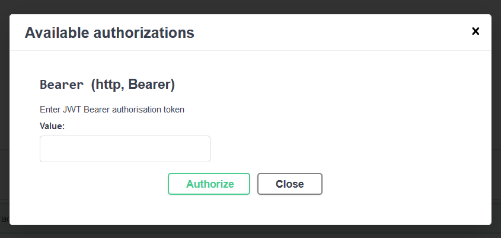
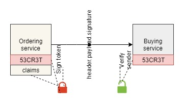
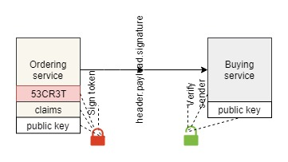

DocumentName: getting_to_grips_with_jwt_in_asp_net_core
Title: Getting to Grips With JWT in ASP.NET Core
Description: Understanding why and how to use JWT in your authentication protocols can be confusing, due to the many different protocols available and the different terminology used. This guide tries to keep things simple, detailing how to integrate a simple JWT-based authentication protocol into your apps.
Published: 2019-09-28
Updated: 2019-09-28
---


## Breaking down authorization
JSON Web Tokens (JWT) are a highly popular and widely used component of client-server authentication. The idea behind JWT is to provide a simple and secure method of exchanging data which can be verified to have been untampered and created by a known party. A JWT is made up of three parts:

* Header - contains metadata about the token
* Payload - this is a set of 'claims' about the requestor
* Signature - a signed combination of the header, payload and secret

When talking about authentication and JWT you will encounter some jargon such as 'claim'. A claim is simply a key-value pairing of data defined by the requestor.

Often JWT are used along with a protocol such as OAuth 2.0, usually being generated by a server, which returns a token based on a request. The requestor will then send this token to a service which will allow them authorization. It is important to understand that JWT is simply a signed token and therefore does not need to be used with any particular protocol. For more information to better understand JWT, visit the [Auth0 page](https://jwt.io/) where you can even create your own through the web UI.

## JWT in ASP.NET Core 3

### Authenticating with Web API

When sending requests over HTTP which require authorisation, an authorisation token is most often sent in the Authorization header. For JWT tokens, the header will be in the format of:

```http
Authorization: Bearer {token}
```

It is important to only send tokens over secure connections.

In ASP.NET Core, HTTP request authorisation can be set up to read a token from the Authorization header with the authentication middleware configuration.

```csharp
// parameter sets default scheme
services.AddAuthentication(JwtBearerDefaults.AuthenticationScheme)
    .AddJwtBearer(options =>
    {
        // validation configuration
        options.TokenValidationParameters = new TokenValidationParameters
        {
            ValidateIssuer = true,
            ValidateAudience = false,
            ValidateIssuerSigningKey = true,
            ValidateLifetime = false,
            // values should be stored securely!
            ValidIssuer = Configuration["Jwt:Issuer"],
            // key type depends on encryption method
            IssuerSigningKey = new SymmetricSecurityKey(Encoding.UTF8.GetBytes(Configuration["Secret"]))
        };
    });
```

This is a very basic validation setup, however additional configuration can be made. For instance, it is possible and likely strongly advisable to validate token lifetime, so that requests containing expired tokens are rejected, or even read a token from somewhere other than the Authorization header. Make sure to look through the properties that you can set on ```TokenValidationParameters``` as they will probably need to be configured differently according to your particular scenario. 

### Defining authorisation on OpenAPI spec

One common scenario where authorisation is implemented is in a RESTful API. You can define authorisation protocol in your OpenAPI spec, which in turn allows you to add authorisation to Swagger UI. This can be done easily if generating your spec with [Swashbuckle.AspNetCore.SwaggerGen](https://www.nuget.org/packages/Swashbuckle.AspNetCore.SwaggerGen/), via middleware configuration. As of October 2019, the latest version is ```5.0.0-rc3``` which allows you to configure it as follows. Bear in mind for versions 4.X.X and lower configuration is different. Further note the following will need to be tweaked if using a protocol.

Firstly, install the library into the startup project.

```powershell
Install-Package Swashbuckle.AspNetCore.SwaggerGen -Version 5.0.0-rc3
```

In the ```ConfigureServices``` method call ```IServicesCollection.AddSwaggerGen(Action<SwaggerGenOptions>)```, which adds the OpenAPI specification generation middleware, allowing definition of authorisation protocols.
Make sure to call ```IApplicationBuilder.UseSwagger()``` to invoke the middleware. 

```csharp
services.AddSwaggerGen(options =>
{
    // define swagger docs and other options

    var securityScheme = new OpenApiSecurityScheme
    {
        Name = "Authorization",
        Description = "Enter JWT Bearer authorisation token",
        In = ParameterLocation.Header,
        Type = SecuritySchemeType.Http,
        Scheme = "bearer", // must be lowercase!!!
        BearerFormat = "Bearer {token}",
        Reference = new OpenApiReference
        {
            Id = JwtBearerDefaults.AuthenticationScheme,
            Type = ReferenceType.SecurityScheme
        }
    };
    options.AddSecurityDefinition(JwtBearerDefaults.AuthenticationScheme, securityScheme);
    options.AddSecurityRequirement(new OpenApiSecurityRequirement
    {
        // defines scope - without a protocol use an empty array for global scope
        { securityScheme, Array.Empty<string>() }
    });
});
```
The generated swagger documentation will include these sections. Once again, if using JWT with a security protocol such as OAuth 2.0 or OpenID Connect, it is important to provide additional configuration.

```json
{
  "components": {
    "securitySchemes": {
      # scheme type definition
      "Bearer": {
        "type": "http",
        "description": "Enter JWT Bearer authorisation token",
        "scheme": "bearer",
        "bearerFormat": "Bearer {token}"
      }
    }
  },
  "security": [
    {
      # defines the scheme globally
      "Bearer": [ ]
    }
  ]
}
```

If using Swagger UI, you will now see a padlock button next to each defined endpoint. Clicking this button and providing a JWT will ensure it is sent in the header of any request that is made through Swagger UI.



### Integrating with SignalR

Authorisation with JWT can happen over SignalR connections. This is configured in the authorisation middleware, by assigning a custom handler for the ```OnMessageReceived``` event. In the handler we can access ```OnMessageReceivedContext```, which contains a reference to the HTTP request and also allows us to explicitly set the token. This snippet was originally taken from [Microsoft documentation](https://docs.microsoft.com/en-us/aspnet/core/signalr/authn-and-authz?view=aspnetcore-3.0#authorize-users-to-access-hubs-and-hub-methods) which goes into futher detail regarding SignalR authorisation.

```csharp
services.AddAuthentication(JwtBearerDefaults.AuthenticationScheme)
    .AddJwtBearer(options =>
    {
        // configure SignalR to be able to read access token
        options.Events = new JwtBearerEvents
        {
            OnMessageReceived = context =>
            {
                var accessToken = context.Request.Query["access_token"];

                // if the request is for a hub...
                var path = context.HttpContext.Request.Path;
                if (!string.IsNullOrEmpty(accessToken) &&
                    (path.StartsWithSegments("/hub/")))
                {
                    // read the token out of the query string
                    context.Token = accessToken;
                }
                return Task.CompletedTask;
            }
        };
    });
```

### Creating a JWT

Many packages exist which make creating a JWT in .NET Core 3 relatively simple. I'm going to focus on how this is done with the use of ```System.IdentityModel.Tokens.Jwt```, a package developed by the Microsoft Azure Active Directory team. This package offers the ```JwtSecurityToken``` class which comprises all the members of a JWT and offers several different constructors to help you create a token.

First off we need to create a ```SigningCredentials``` object containing the secret and the signing algorithm. Decide what signing algorithm you require and how to store and retrieve the secret. We can simply store this secret in the source code, or in the application settings, however this introduces vunerabilities as it allows anyone with the ability to access the source code to access the secret. To get around this, it is important to use a secure storage mechanism where the secret itself is encrypted. This can be through the use of something like Docker secrets, if using Docker Swarm for deployment, or a service such as Azure Key Vault. Generally the secret will be accessible via configuration, no matter how it is stored.

Create and sign the key by retrieving the secret from your application configuration. You can read on for a further explanation of Symmetric vs Asymmetric keys and different security algorithms for signing the key, of which there are many.

```csharp
var key = new SymmetricSecurityKey(Encoding.UTF8.GetBytes(configuration["Secret"]));
var signingCredentials = new SigningCredentials(key, SecurityAlgorithms.HmacSha256);
```

Along with the key you need to create the payload. For this, you need to create an array of claims to store in the token. A claim simply consists of a key-value pair and you can create standard claims and also custom claims. Standard claim names are stored as constant fields in the ```JwtRegisteredClaimNames``` class.

```csharp
var userIdentifierClaim = new Claim(JwtRegisteredClaimNames.Sub, "X");
var issuerClaim = new Claim(JwtRegisteredClaimNames.Iss, "Y");
var customPlanetClaim = new Claim("planet", "Jupiter");
var claims = new Claim[] { userIdentifierClaim, issuerClaim, customPlanetClaim };
```

With the claims and the key created, you can construct the JWT. As the header of a JWT only contains metadata about the key, you do not need to explicitly set this. It will already be set based on what is passed in as the payload and the key.

```csharp
var token = new JwtSecurityToken(
    claims: claims,
    signingCredentials: signingCredentials
);
```

Now that you have the token stored in an object, you will probably want to do the final step of retrieving the JWT as a string. You might think that calling ```JwtSecurityToken.ToString()``` will do this, however it only serialises the header and the payload and will not create a signed token. To create the signed token you need to create an instance of the ```JwtSecurityTokenHandler``` class which contains a method to write the token to a string.

```csharp
var jwtToken = new JwtSecurityTokenHandler().WriteToken(token);
```

## Algorithms for signing JWTs

In the examples shown so far, all the tokens which are created and validated are symmetric tokens which are signed using HMAC-SHA256 encryption. This is probably the most common method used and requires the secret to be secured appropriately. Other methods of encryption provide varying levels of security, though HMAC-SHA256 is generally quick enough and highly secure.

### Symmetric algorithms

A symmetric algorithm uses a single secret which is used for encryption of data. Therefore both the sending and receiving party require knowledge of the same secret to be able to securely share the data. This makes it especially good for securing communication between two services which are both under your control. This includes a setup where you have an authentication server which a user calls, returning a token that is signed with a secret and validated by your service with the same secret. In almost all cases which require token authentication, a symmetric algorithm will be adaquate.




### Asymmetric algorithms

An asymmetric algorithm composes both a public key and private secret. The public key can be available to anyone and can only verify messages which are signed with a particular secret. What this allows is for a receiving party of a message to verify that a particular party created the message, by using the public key.



A JWT can be asymmetrically signed, though it would require a very particular scenario for this to be beneficial. There would have to be a requirement of the same key being needed to authenticate with two or more seperate externally-controlled applications. One possibility of this scenario would be having a central login service used by a number of applications, which are developed by different teams. The login service could return an asymmetrically signed JWT which allows each application to verify that a user is signed in, however does not allow any of these applications to generate a valid token. This reduces the amount of work needed to do a security audit as auditing the login server would display inherent trust in the other applications.