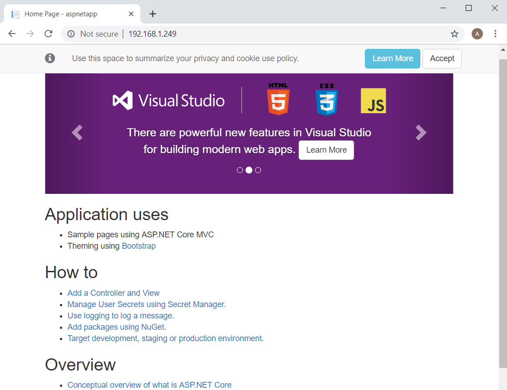

DocumentName: setting_up_an_asp_net_core_web_farm
Title: Deploying a Kestrel Server on a Web Farm
Description: So you've set up your storage, network, load balancer and your DNS. To host an ASP.NET Core app in a web farm, this takes you through the little extra configuration required in your app.
Thumbnail: 512e4dd1-6b3d-41aa-80a1-b96c3370b3c3
Published: 2019-08-11
Updated: 2019-08-11
---


## Web farm configuration

### Reading HTTP headers

In the setup of a web farm, the load balancer is receiving the request from the client and the web application server is receiving a request from the load balancing server, but we might need the web server to be able to access information about the original request. Information about the original request can be sent in the HTTP headers and ASP.NET Core allows us to use the following:

* XForwardedFor - contains the IP of the client that created the initial request
* XForwardedProto - identifies the protocol of the original request such as http or https
* XForwardedHost - the value of the host header, which is used to distinguish from multiple host names on the same IP

```csharp
public void ConfigureServices(IServiceCollection services)
{
    var loadBalancerAddress = "192.168.1.200";
    services.Configure<ForwardedHeadersOptions>(options =>
    {
        options.ForwardedHeaders =
            ForwardedHeaders.XForwardedFor |
            ForwardedHeaders.XForwardedProto;
        options.KnownProxies.Add(IPAddress.Parse(loadBalancerAddress));
    });
}

public void Configure(IApplicationBuilder app, IHostingEnvironment env)
{
    app.UseForwardedHeaders();
}
```

In ```Startup.cs``` we configure the server to read the headers we need and we can also add the local IP of the device we will run our load balancer on, to make sure that we are only reading headers from authentic requests, protecting against IP spoofing.

### HTTP or HTTPS?

All requests to the web servers are being routed through the load balancer. Data has already gotten through to the local network and thus, as you are hopefully setting this up on a private network, subsequent requests inside the network can likely be unencrypted. Of course if you chose to, you could use HTTPS for requests over the local network. Whether it is needed or not would depend on who has access to it.

Opting to use HTTP will mean that you need to remove any HTTPS configuration that your web application might contain, or to use HTTPS you will need to [configure it in your application](https://docs.microsoft.com/en-us/aspnet/core/security/enforcing-ssl?view=aspnetcore-2.2&tabs=visual-studio) appropriately.

## Dockerising ASP.NET Core

Using Docker simplifies the deployment process and all that we have to do to dockerise the application is to create a Dockerfile at the root of the project.

```dockerfile
FROM mcr.microsoft.com/dotnet/core/aspnet:2.2 AS base  # runtime base image to use
WORKDIR /app
EXPOSE 80  # port that the container exposes

FROM mcr.microsoft.com/dotnet/core/sdk:2.2 AS build  # sdk base image to use
WORKDIR /src
COPY ["pathTo.csproj", "./"]  # syntax [host, container] ./ references current working directory
RUN dotnet restore "nameOf.csproj"
COPY . .
WORKDIR "/src"
RUN dotnet build "nameOf.csproj" -c Release -o /app

FROM build AS publish
RUN dotnet publish "nameOf.csproj" -c Release -o /app

FROM base AS final
WORKDIR /app
COPY --from=publish /app .
ENTRYPOINT ["dotnet", "projectName.dll"]
```

This Dockerfile copies the web application project file to the /src directory of the container, restores the project, builds the project in the release environment and publishes the dll. The dll file is output in the /app directory of the container which is set as the container entrypoint.

We can commit this to our web application repository and from there we will be ready to deploy it on to our servers. Ideally we would have a build agent set up that builds our application when the master branch is updated. This build agent would build our Docker image and push it to an image repository, such as Docker Hub. Doing such a thing for running on the Raspberry Pi should possible with an ARM build agent, or by using an emulator such as QEMU. For now, pulling on the the device with Git takes less work and isn't much less efficient.

## Running on top of Kestrel

Clone the web application on to the machine and run ```docker build```, which will output an image for your container.

```bash
docker build ./ -t imageName
```

You can then run the container via the Docker CLI, or alternatively you can create a Docker Compose file to contain the run configuration.

```bash
docker run -it -p 80:80 imageName:latest
```

We map port 80 on the host machine to the port we exposed in the Dockerfile, allowing the load balancer to route requests to the server. To check that your container is running, navigate to the local IP of the machine in your browser, which will by default try to access port 80.

